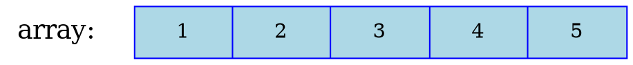
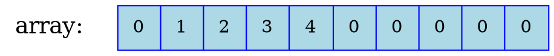
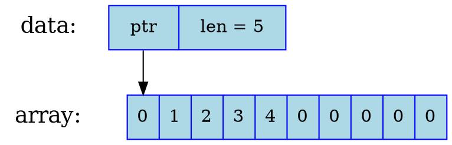
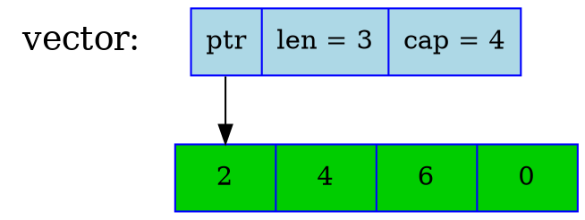
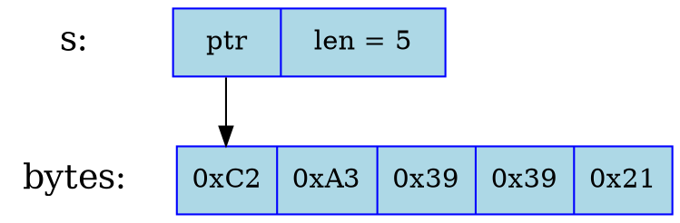
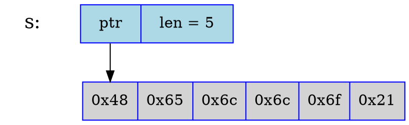
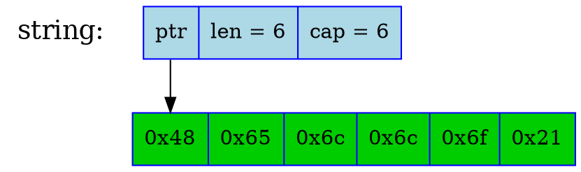

# Структурная конкурентность

Незабываемые типы

## Дисклеймер

Этот доклад требует продвинутого понимания языка Rust и в первую очередь сделан для любителей языка.

## Работать в асинхронном Rust тяжело.

Notes:

За сложностью использования async в Rust стоят вполне определённые причины.
В контрасте с многопоточным кодом возникают проблемы с заимствованием (borrowing) и тред-безопасыми (thread-safe) типами.

## Асинхронные задачи (async tasks)

```rust [1-7|3-5|7]
use tokio::task;
let s0 = "Hello, world!".to_string();
let t0 = task::spawn(async {
    do_work(s0).await
});
do_other_work().await;
let r0 = t0.await;
```

Notes:

Пример использования асинхронных задач (async tasks) из tokio.

## Заимствование в задачах

```rust [1-7|2,4|3]
let s0 = "Hello, world!".to_string();
let s1 = &s0[..];
let t0 = task::spawn(async { // ERROR: `s1` must be `'static`
    do_work(s1).await
});
do_other_work().await;
let r0 = t0.await;
```

## Задачи могут быть только `'static`

```rust []
pub fn spawn<F>(future: F) -> JoinHandle<F::Output>
where
    F: Future + Send + 'static,
    F::Output: Send + 'static,
{ /* ... */ }
```

Notes:

Исполнение задачи, в зависимости от вашего кода, может занять сколько угодно времени, даже если какие-то заимствующие ссылки (borrows) станут недействительными.

## Решение: ждать завершение задачи

```rust []
pub fn spawn_scoped<'a, F>(future: F) -> ScopedJoinHandle<'a, F::Output>
where
    F: Future + Send + 'a,
    F::Output: Send + 'a,
{ /* ... */ }

impl<T> Drop for ScopedJoinHandle<'_, T> {
    fn drop(&mut self) {
        block_on(self);
    }
}
```

## Rust не гарантирует вызова drop

```rust [1-8|1,7|3,5,8]
use std::mem::forget;
let mut s0 = "Hello, world!".to_string();
let s1 = &s0[..];
let t0 = task::spawn_scoped(async {
    do_work(s1).await;
});
forget(t0);
s0.clear(); // `t0` could use now invalid `s1`
```

Notes:

Существует такая функция `std::mem::forget`, которая просто убирает аргумент из scope, не вызывая деструктор, aka `drop`.

С помощью нее можно просто забыть о ранее запущенных задач, даже если они заимствуют локальные данные на стэке, которые впоследствии станут недействительными.

## Заимствующие потоки (threads)

```rust []
use std::thread;
let mut s0 = "Hello, world!".to_string();
let s1 = &s0[..];
let t0 = thread::scoped(|| {
    do_work(s1);
});
forget(t0);
s0.clear(); // `t0` could use now invalid `s1`
```

## `std::mem::forget`

```rust []
struct Leak<T>(mpsc::Receiver<Leak<T>>, T);

pub fn forget<T>(data: T) {
    let (tx, rx) = mpsc::channel();
    tx.send(Leak(rx, data)).unwrap(); // Create a cycle
}
```

Notes:

Почему же такая плохая функция присутствует в языке?
На самом деле сегодня Rust не может гарантировать, чтобы вызов вообще drop произошёл.
Это можно проиллюстрировать создав подобную функцию с помощью mpsc каналов.

Об этом факте узнали совсем незадолго до релиза Rust 1.0.
До этого такая гарантия присутствовала в языке, но потом из-за временных рамок от неё решили просто отказаться.

## `std::thread::scope`

```rust [1-9|1-3|4-6|7|8]
let s0 = String::from("Hello, world!");
let s1 = &s0[..];
std::thread::scope(|scope| {
    let t0 = scope.spawn(|| {
        do_work(s1);
    });
    do_other_work();
    let r0 = t0.join().unwrap();
})
```

Notes:

В случае с потоками эту проблему обошли с помощью `std::thread::scope`.
Данный интерфейс работает с помощью подпрограмм (subroutines), то есть обычных функций, а точнее с помощью гарантированного порядка исполнения вложенных подпрограмм.

## `tokio::task::scope`?

```rust [1-9|9]
let s0 = String::from("Hello, world!");
let s1 = &s0[..];
task::scope(async |scope| {
    let t0 = scope.spawn(async {
        do_work(s1).await;
    });
    do_other_work().await;
    let r0 = t0.await;
}).await
```

## Контрпример

```rust [1-15|4-10|3,11|12|12,5-7|12-13,8|14|15]
let mut s0 = String::from("Hello, world!");
let s1 = &s0[..];
let mut fut = Box::pin(async {
    task::scope(async |scope| {
        let t0 = scope.spawn(async {
            do_work(s1).await;
        });
        task::yield_now().await;
        let r0 = t0.await;
    }.await
}));
assert_eq!(poll_once(fut.as_mut()), Poll::Pending);
// `fut` progress is now on line 8
forget(fut);
s0.clear(); // `t0` could use now invalid `s1`
```

Notes:

В контрасте, асинхронный Rust реализован с помощью сопрограмм (coroutines), вследствие чего вышеупомянутый подход просто так не работает.

В данном примере мы используем гипотетический интерфейс внутри футуры, которую мы выполним только наполовину, а затем забудем.
Для этого мы воспользуемся `yield_now` футурой, способной один раз приостанавливать исполнение async кода.

## `Forget` маркер

```rust []
unsafe auto trait Forget {}

impl<T: Forget> Arc<T> {
    pub fn new(data: T) -> Self {
        // ...
    }
}
```

Notes:

Одно из напрашивающихся решений - добавить новый маркер-трейт по аналогии с `Send`, который даст использовать `forget`, `Rc` и другие интерфейсы по отношению, не ко всем, а только к "забываемым" типам.

## Вложенные незабываемые типы

```rust []
pub struct JoinGuard<'a, T> {
    // ...
}
// JoinGuard<'a, T>: !Forget => Foo<'a, T>: !Forget
struct Foo<'a, T> {
    inner: JoinGuard<'a, T>,
    other_data: i32,
}
```

Notes:

Нам важно чтобы, например, тип `JoinGuard` не смог попасть в `forget` или `Rc`, даже если он вложен внутри другой структуры.
То есть если какое-то поле структуры (`inner`) имеет незабываемый тип, то и тип самой структуры (`Foo`) считается незабываемым.

## `Forget` не предотвращает утечки памяти

```rust []
fn forget<T: 'static>(data: T) {
    std::thread::spawn(move || {
        let _data = data;
        loop {} // drop(_data) is never called
    });
}
```

Notes:

Даже если мы определим тип как незабываемый (`!Forget`), это не даёт гарантию, что drop объекта когда-либо произойдёт, как например если бы мы поместили такой объект в тред с бесконечным циклом.
Это не позволяет нам так просто избавиться от утечек памяти, как до этого люди долго представляли себе решение этой проблемы.
Поэтому в ранних упоминаниях `Forget` именуется `Leak`.

## ¯\\_ (ツ)_/¯

Notes:

Чтож, мы уже считаем утечки памяти безопасными, поэтому какая разница?
Главное, что `!Forget` заставляет компилятор всегда ассоциировать конец жизни объекта с вызовом drop, когда бы это не произошло.
В случае с `JoinGuard<’a, T>` это действительно предотвращает инвалидацию заимствованных ссылок в купе с временем жизни `‘a`, так как borrow checker уже следит за концом жизни любого объекта c лайфтаймом.

## `T: 'static` означает `T: Forget`?

```rust []
fn forget<T: 'static>(data: T) {
    std::thread::spawn(move || {
        let _data = data;
        loop {} // drop(_data) is never called
    });
}
```

Notes:

В таком случае, ничто не мешает нам утверждать, что `T: ’static` типы автоматически предполагают и `T: Forget`.
На самом деле для этого есть своя причина о которой я расскажу чуточку позже.

## Рандеву каналы

```rust [|4,8]
let (tx, rx) = rendezvois_channel();
let t0 = std::thread::spawn(move || {
    do_work();
    let data = rx.recv().unwrap();
    process_data(data);
});
let data = fetch_data();
tx.send(data).unwrap();
```

Notes:

Для начала мне нужно уточнить что такое рандеву канал.

## Циклы владения тредами

```rust [|4,5,8]
let mut s0 = "Hello, world!".to_string();
let s1 = &s0[..];
let (tx, rx) = rendezvois_channel();
let t0 = std::thread::scoped(move || {
    let t0 = rx.recv().unwrap();
    do_work(s1);
});
tx.send(t0).unwrap();
s0.clear(); // `t0` could use now invalid `s1`
```

Notes:

К сожалению ещё остаётся одна проблема: можно поместить заимствующий тред сам в себя с помощью рандеву канала, хотя казалось бы обычными рекурсивными структурами такой цикл невозможно создать.
...

## Вопросы

## Using Arrays

Arrays (`[T; N]`) have a fixed size.

```rust []
fn main() {
    let array = [1, 2, 3, 4, 5];
    println!("array = {:?}", array);
}
```

<br>



## Building the array at runtime.

How do you know how many 'slots' you've used?

```rust []
fn main() {
    let mut array = [0u8; 10];
    for idx in 0..5 {
        array[idx] = idx as u8;
    }
    println!("array = {:?}", array);
}
```

<br>



## Slices

A view into *some other data*. Written as `&[T]` (or `&mut [T]`).

```rust [1-8|6]
fn main() {
    let mut array = [0u8; 10];
    for idx in 0..5 {
        array[idx] = idx as u8;
    }
    let data = &array[0..5];
    println!("data = {:?}", data);
}
```

<br>



Note:
Slices are *unsized* types and can only be access via a reference. This reference is a 'fat reference' because instead of just containing a pointer to the start of the data, it also contains a length value.

## Vectors

`Vec` is a growable, heap-allocated, array-like type.

```rust []
fn process_data(input: &[u32]) {
    let mut vector = Vec::new();
    for value in input {
        vector.push(value * 2);
    }
    println!("vector = {:?}, first = {}", vector, vector[0]);
}

fn main() { process_data(&[1, 2, 3]); }
```

<br>



Note:

The green block of data is heap allocated.

## There's a macro short-cut too...

```rust
fn main() {
    let vector = vec![1, 2, 3, 4];
    let buffer = vec![0u8; 128];
}
```

<br>

Check out the [docs](https://doc.rust-lang.org/std/vec/struct.Vec.html)!

## Features of Vec

* Growable (will re-allocate if needed)
* Can borrow it as a `&[T]` slice
* Can access any element (`vector[i]`) quickly
* Can push/pop from the back easily

## Downsides of Vec

* Not great for insertion
* Everything must be of the same type
* Indices are always `usize`

## String Slices

The basic string types in Rust are all UTF-8.

A *String Slice* (`&str`) is an immutable view on to some valid UTF-8 bytes

```rust
fn main() {
    let bytes = [0xC2, 0xA3, 0x39, 0x39, 0x21];
    let s = std::str::from_utf8(&bytes).unwrap();
    println!("{}", s);
}
```

<br>



Note:

A string slice is tied to the lifetime of the data that it refers to.

## String Literals

* String Literals produce a string slice "with static lifetime"
* Points at some bytes that live in read-only memory with your code

```rust []
fn main() {
    let s: &'static str = "Hello!";
    println!("s = {}", s);
}
```

<br>



Note:

The lifetime annotation of `'static` just means the string slice lives forever
and never gets destroyed. We wrote out the type in full so you can see it - you
can emit it on variable declarations.

There's a second string literal in this program. Can you spot it?

(It's the format string in the call to `println!`)

## Strings ([docs](https://doc.rust-lang.org/std/string/struct.String.html))

* A growable collection of `char`
* Actually stored as a `Vec<u8>`, with UTF-8 encoding
* You cannot access characters by index (only bytes)
  * But you never really want to anyway

```rust
fn main() {
    let string = String::from("Hello!");
}
```

<br>



Note:

The green block of data is heap allocated.

## Making a String

```rust [1-7|2|3|4|5|6]
fn main() {
    let s1 = "String literal up-conversion".to_string();
    let s2: String = "Into also works".into();
    let s3 = String::from("Or using from");
    let s4 = format!("String s1 is {:?}", s1);
    let s5 = String::new(); // empty
}
```

## Appending to a String

```rust [1-7|2,4|3|4|5-6]
fn main() {
    let mut start = "Mary had a ".to_string();
    start.push_str("little");
    let rhyme = start + " lamb";
    println!("rhyme = {}", rhyme);
    // println!("start = {}", start);
}
```

## Joining pieces of String

```rust [1-5|2|3|4]
fn main() {
    let pieces = ["Mary", "had", "a", "little", "lamb"];
    let rhyme = pieces.join(" ");
    println!("Rhyme = {}", rhyme);
}
```

## VecDeque ([docs](https://doc.rust-lang.org/std/collections/struct.VecDeque.html))

A ring-buffer, also known as a Double-Ended Queue:

```rust []
use std::collections::VecDeque;
fn main() {
    let mut queue = VecDeque::new();
    queue.push_back(1);
    queue.push_back(2);
    queue.push_back(3);
    println!("first: {:?}", queue.pop_front());
    println!("second: {:?}", queue.pop_front());
    println!("third: {:?}", queue.pop_front());
}
```

## Features of VecDeque

* Growable (will re-allocate if needed)
* Can access any element (`queue[i]`) quickly
* Can push/pop from the front or back easily

## Downsides of VecDeque

* Cannot borrow it as a single `&[T]` slice without moving items around
* Not great for insertion in the middle
* Everything must be of the same type
* Indices are always `usize`

## HashMap ([docs](https://doc.rust-lang.org/std/collections/struct.HashMap.html))

If you want to store *Values* against *Keys*, Rust has `HashMap<K, V>`.

Note that the keys must be all the same type, and the values must be all the same type.

```rust
use std::collections::HashMap;
fn main() {
    let mut map = HashMap::new();
    map.insert("Triangle", 3);
    map.insert("Square", 4);
    println!("Triangles have {:?} sides", map.get("Triangle"));
    println!("Triangles have {:?} sides", map["Triangle"]);
    println!("map {:?}", map);
}
```

Note:
The index operation will panic if the key is not found, just like with slices and arrays if the index is out of bounds. Get returns an `Option`.

If you run it a few times, the result will change because it is un-ordered.

## The Entry API

What if you want to *update an existing value* __OR__ *add a new value if it's not there yet*?

`HashMap` has the *Entry API*:

```rust ignore
enum Entry<K, V> {
    Occupied(...),
    Vacant(...),
}

fn entry(&mut self, key: K) -> Entry<K, V> {
    ...
}
```

## Entry API Example

```rust []
use std::collections::HashMap;

fn update_connection(map: &mut HashMap<i32, u64>, id: i32) {
    map.entry(id)
        .and_modify(|v| *v = *v + 1)
        .or_insert(1);
}

fn main() {
    let mut map = HashMap::new();
    update_connection(&mut map, 100);
    update_connection(&mut map, 200);
    update_connection(&mut map, 100);
    println!("{:?}", map);
}
```

## Features of HashMap

* Growable (will re-allocate if needed)
* Can access any element (`map[i]`) quickly
* Great at insertion
* Can choose the *Key* and *Value* types independently

## Downsides of HashMap

* Cannot borrow it as a single `&[T]` slice
* Everything must be of the same type
* Unordered

## BTreeMap ([docs](https://doc.rust-lang.org/std/collections/struct.BTreeMap.html))

Like a `HashMap`, but kept in-order.

```rust
use std::collections::BTreeMap;
fn main() {
    let mut map = BTreeMap::new();
    map.insert("Triangle", 3);
    map.insert("Square", 4);
    println!("Triangles have {:?} sides", map.get("Triangle"));
    println!("Triangles have {:?} sides", map["Triangle"]);
    println!("map {:?}", map);
}
```

## Features of BTreeMap

* Growable (will re-allocate if needed)
* Can access any element (`map[i]`) quickly
* Great at insertion
* Can choose the *Key* and *Value* types independently
* Ordered

## Downsides of BTreeMap

* Cannot borrow it as a single `&[T]` slice
* Everything must be of the same type
* Slower than a `HashMap`

## Sets

We also have [HashSet](https://doc.rust-lang.org/std/collections/struct.HashSet.html) and [BTreeSet](https://doc.rust-lang.org/std/collections/struct.BTreeSet.html).

Just sets the `V` type parameter to `()`!

---

| Type         | Owns | Grow |  Index  | Slice | Cheap Insert |
| :----------- | :--: | :--: | :-----: | :---: | :----------: |
| Array        |  ✅  |  ❌  | `usize` |  ✅   |      ❌      |
| Slice        |  ❌  |  ❌  | `usize` |  ✅   |      ❌      |
| Vec          |  ✅  |  ✅  | `usize` |  ✅   |      ↩       |
| String Slice |  ❌  |  ❌  |   🤔   |  ✅   |      ❌      |
| String       |  ✅  |  ✅  |   🤔   |  ✅   |      ↩       |
| VecDeque     |  ✅  |  ✅  | `usize` |  🤔  |    ↪ / ↩     |
| HashMap      |  ✅  |  ✅  |   `T`   |  ❌   |      ✅      |
| BTreeMap     |  ✅  |  ✅  |   `T`   |  ❌   |      ✅      |

Note:

The 🤔 for indexing string slices and Strings is because the index is a byte
offset and the system will panic if you try and chop a UTF-8 encoded character
in half.

The 🤔 for indexing VecDeque is because you might have to get the contents in
two pieces (i.e. as two disjoint slices) due to wrap-around.

Technically you *can* insert into the middle of a Vec or a String, but we're
talking about 'cheap' insertions that don't involve moving too much stuff
around.
